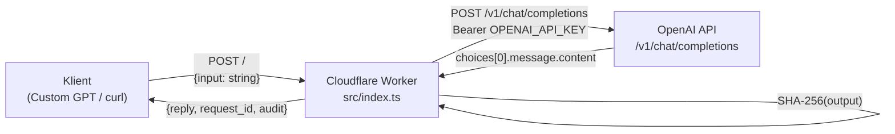

# ai-backend

> Governed OpenAI backend běžící jako **Cloudflare Worker** — přijímá uživatelský vstup, předává ho OpenAI GPT-4.1 a vrací auditovatelnou odpověď s hash-otisky vstupu i výstupu.

---

## Obsah

- [Co to je](#co-to-je)
- [Quickstart](#quickstart)
- [Architektura](#architektura)
- [API reference](#api-reference)
- [Konfigurace a secrets](#konfigurace-a-secrets)
- [Deploy](#deploy)

> 📄 Stručný A–H přehled pro nové přispěvatele: [`docs/overview.md`](docs/overview.md)  
> 🔍 Detailní auditní zpráva: [`docs/audit.md`](docs/audit.md)

---

## Co to je

Single-endpoint HTTP backend (Cloudflare Worker, TypeScript) sloužící jako proxy vrstva nad OpenAI Chat Completions API. Každý požadavek dostane unikátní `request_id` a SHA-256 otisky vstupu i výstupu pro auditní sledovatelnost.

**Cílový uživatel:** vývojáři budující Custom GPT nebo jiné AI aplikace, kteří potřebují:
- řízenou bránu k OpenAI (jedno místo pro API klíč, budoucí rate-limiting, logging),
- auditní stopu každé interakce (vstupní a výstupní hash),
- minimální latenci díky edge deploymentu (Cloudflare Workers).

---

## Quickstart

### Předpoklady

- Node.js ≥ 20
- [Wrangler CLI](https://developers.cloudflare.com/workers/wrangler/): `npm install -g wrangler`
- Cloudflare účet s aktivním Workers plánem
- OpenAI API klíč

### Lokální vývoj

```bash
# 1. Klonuj repozitář
git clone https://github.com/kernel-spec/ai-backend.git
cd ai-backend

# 2. Přidej secret (lokálně přes .dev.vars nebo wrangler secret)
echo "OPENAI_API_KEY=sk-..." > .dev.vars

# 3. Spusť lokální server
wrangler dev
```

### Testovací volání

```bash
curl -X POST http://localhost:8787 \
  -H "Content-Type: application/json" \
  -d '{"input": "Napiš hello world v Pythonu."}'
```

---

## Architektura



**Datový tok (krok za krokem):**

1. Klient pošle `POST /` s tělem `{ "input": "<text>" }`.
2. Worker odmítne vše kromě POST (→ 405) a nevalidní JSON (→ 400).
3. Vygeneruje `request_id` (UUID v4) a SHA-256 otisk vstupu.
4. Zavolá `https://api.openai.com/v1/chat/completions` s modelem `gpt-4.1` a `temperature: 0.2`.
5. Při selhání OpenAI vrátí `502 { error: "OpenAI error" }`.
6. Vypočítá SHA-256 otisk výstupu.
7. Vrátí `{ reply, request_id, audit: { input_hash, output_hash } }`.

---

## API reference

### `POST /`

**Vstup (JSON body):**

| Pole    | Typ    | Povinné | Popis               |
|---------|--------|---------|---------------------|
| `input` | string | ✅      | Text dotazu pro AI  |

**Výstup (200 OK):**

```json
{
  "reply": "<odpověď modelu>",
  "request_id": "<uuid-v4>",
  "audit": {
    "input_hash": "<sha256-hex>",
    "output_hash": "<sha256-hex>"
  }
}
```

**Chybové stavy:**

| Kód | Důvod                         |
|-----|-------------------------------|
| 400 | Chybějící/neplatný JSON nebo `input` |
| 405 | Metoda není POST              |
| 502 | Chyba na straně OpenAI        |

---

## Konfigurace a secrets

| Proměnná           | Kde se nastavuje                              | Popis                          |
|--------------------|-----------------------------------------------|--------------------------------|
| `OPENAI_API_KEY`   | Cloudflare Workers Secret (UI nebo wrangler)  | API klíč pro OpenAI            |
| `CLOUDFLARE_API_TOKEN` | GitHub Secret (pro CI deploy)             | Token pro wrangler deploy      |

Viz `.env.example` pro lokální vývoj.

### Nastavení secrets (produkce)

```bash
wrangler secret put OPENAI_API_KEY
```

### Nastavení secrets (CI/CD)

V GitHub repozitáři → Settings → Secrets → Actions:
- `CLOUDFLARE_API_TOKEN`

---

## Deploy

### Manuálně

```bash
wrangler deploy
```

### Automaticky (CI/CD)

Každý push na větev `main` spustí GitHub Actions workflow `.github/workflows/deploy.yml`, který provede `wrangler deploy` pomocí `cloudflare/wrangler-action@v3`.

Vyžaduje GitHub Secret `CLOUDFLARE_API_TOKEN`.

