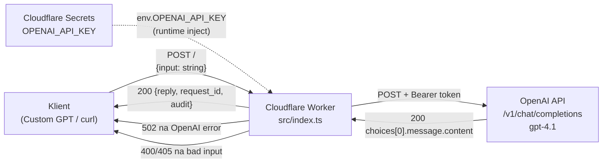

# Repo Intelligence Report — `kernel-spec/ai-backend`

> Vygenerováno: 2026-02-25 | Autor: GitHub Copilot Coding Agent  
> Cíl: umožnit novému členu pochopit projekt do 5 minut.

---

## Stack (dolož soubory)

| Technologie | Důkaz |
|---|---|
| TypeScript | `src/index.ts` |
| Cloudflare Workers | `wrangler.toml` → `name = "ai-backend"`, `main = "src/index.ts"` |
| OpenAI API (gpt-4.1) | `src/index.ts` řádek 43 |
| GitHub Actions CI/CD | `.github/workflows/deploy.yml` |

---

## 0) Klíčové soubory

| Soubor | Role | Proč klíčový |
|---|---|---|
| `src/index.ts` | Jediný Worker handler | Veškerá business logika, routing, volání OpenAI |
| `wrangler.toml` | Cloudflare konfigurace | Runtime, kompatibilita, název služby |
| `.github/workflows/deploy.yml` | CI/CD pipeline | Automatický deploy na push do main |
| `README.md` | Dokumentace | Overview, Quickstart, API reference |
| `.env.example` | Šablona konfigurace | Popis všech potřebných secrets |
| `contracts/README.md` | (prázdný) | Rezervováno pro API kontrakty |

---

## A) Co to je

**Jednořádkový popis:** Cloudflare Worker fungující jako auditovatelná proxy brána mezi klientem (Custom GPT / curl) a OpenAI Chat Completions API.  
**Důkaz:** `src/index.ts` řádek 34 — `fetch("https://api.openai.com/v1/chat/completions", ...)`; `wrangler.toml` řádek 1 — `name = "ai-backend"`.

---

## B) Pro koho a k čemu

- **Custom GPT autoři** — potřebují HTTP endpoint, který drží OpenAI klíč na serverové straně (`src/index.ts:39`)
- **Vývojáři auditních systémů** — každá interakce dostane SHA-256 otisk vstupu i výstupu (`src/index.ts:25–70`)
- **Edge-performance aplikace** — díky Cloudflare Workers minimální latence globálně (`wrangler.toml`)
- **Teams s jedním API klíčem** — klíč uložen jako Cloudflare secret, sdílené přes Worker (`wrangler.toml:5–6` + komentář)
- **Integrační testy AI pipeline** — `request_id` (UUID v4) umožňuje sledovat jednotlivá volání (`src/index.ts:22`)

---

## C) Struktura repozitáře

| Cesta | Role | Poznámka |
|---|---|---|
| `src/index.ts` | Cloudflare Worker handler | Jediný zdrojový soubor |
| `wrangler.toml` | Wrangler konfigurace | `compatibility_date = "2024-01-01"`, žádné vars |
| `.github/workflows/deploy.yml` | GitHub Actions workflow | Deploy na push do main (opraveno — viz sekce G) |
| `contracts/README.md` | Placeholder | Prázdný, připraven pro OpenAPI/JSON Schema |
| `README.md` | Dokumentace projektu | Aktualizováno: Quickstart, Mermaid, API ref |
| `.env.example` | Šablona secrets | Nový soubor |
| `docs/audit.md` | Tento report | Nový soubor |

---

## D) Architektura & datové toky

### Textový popis

1. Klient (Custom GPT, curl, aplikace) pošle `POST /` s JSON `{ "input": "<text>" }`.
2. Worker ověří HTTP metodu → 405 pokud není POST (`src/index.ts:4–6`).
3. Worker parsuje JSON tělo → 400 pokud není validní (`src/index.ts:10–14`).
4. Worker ověří přítomnost a typ `input` → 400 pokud chybí (`src/index.ts:16–19`).
5. Vygeneruje `request_id` = `crypto.randomUUID()` (`src/index.ts:22`).
6. Vypočítá SHA-256 otisk vstupu pomocí `crypto.subtle.digest` (`src/index.ts:25–31`).
7. Zavolá OpenAI `/v1/chat/completions` s `model: "gpt-4.1"`, `temperature: 0.2`, `Bearer OPENAI_API_KEY` (`src/index.ts:34–50`).
8. Při HTTP chybě OpenAI vrátí `502 { error: "OpenAI error" }` (`src/index.ts:52–57`).
9. Extrahuje text odpovědi z `data.choices[0].message.content` (`src/index.ts:60–61`).
10. Vypočítá SHA-256 otisk výstupu (`src/index.ts:64–70`).
11. Vrátí `{ reply, request_id, audit: { input_hash, output_hash } }` s `Content-Type: application/json` (`src/index.ts:73–85`).
12. Secret `OPENAI_API_KEY` přichází z Cloudflare Workers Secrets (environment `env`), nikdy není v kódu.

### Mermaid diagram



---

## E) Mapa rozhraní

### 1) HTTP endpointy

| Metoda | Path | Handler | Auth? | Vstup | Výstup | Poznámka |
|---|---|---|---|---|---|---|
| POST | `/` | `fetch()` v `src/index.ts` | Ne (klientská auth nelze doložit) | `{ input: string }` | `{ reply, request_id, audit }` | Jediný endpoint |
| GET/PUT/DELETE/… | `/` | stejný handler | — | — | `405 Method Not Allowed` | Catch-all |

> **Poznámka:** Žádná klientská autentizace (Bearer/JWT/OAuth) není implementována. Kdokoli s URL může volat Worker.

### 2) Eventy / cron / queue

| Typ | Spouštěč | Handler | Payload | Side effects |
|---|---|---|---|---|
| CI deploy | push na `main` | `deploy.yml` → `wrangler-action` | git commit | Nový Worker na Cloudflare |

Žádné scheduled/cron eventy, žádné message queues — nelze doložit jejich existenci.

---

## F) Jak spustit / testovat / buildit / deployovat

```bash
# Lokální vývoj (vyžaduje .dev.vars s OPENAI_API_KEY)
wrangler dev                        # spustí lokální server na http://localhost:8787

# Testovací curl
curl -X POST http://localhost:8787 \
  -H "Content-Type: application/json" \
  -d '{"input": "Ahoj světe"}'

# Deploy do produkce (manuálně)
wrangler deploy

# Deploy přes CI
git push origin main                # GitHub Actions spustí deploy.yml automaticky
```

> **Upozornění:** Žádné automatizované testy (unit/integration) neexistují — viz sekce I.

---

## G) CI/CD přehled

| Soubor | Název | Spouštěč | Co dělá |
|---|---|---|---|
| `.github/workflows/deploy.yml` | Deploy Worker | `push` na `main` | Checkout → Node 20 setup → `wrangler deploy` |

> **Opravená chyba:** Původní `deploy.yml` měl pouze krok `actions/checkout@v4` — chyběly kroky pro `setup-node` a `wrangler-action`. Workflow se tedy "úspěšně" dokončoval, ale Worker se nikdy nedeployoval. Opraveno přidáním `actions/setup-node@v4` a `cloudflare/wrangler-action@v3`.

---

## H) Integrace & konfigurace

### ENV / Secrets

| Proměnná | Kde se čte | Řádek/sekce |
|---|---|---|
| `OPENAI_API_KEY` | `src/index.ts` přes `env.OPENAI_API_KEY` | řádek 39 |
| `CLOUDFLARE_API_TOKEN` | `.github/workflows/deploy.yml` přes `secrets.CLOUDFLARE_API_TOKEN` | řádek 20 |

> Žádné `.env` soubory, žádný `dotenv` — Cloudflare Workers používají runtime `env` objekt předávaný handleru.

### Externí služby

| Služba | URL | Kde se používá |
|---|---|---|
| OpenAI Chat Completions | `https://api.openai.com/v1/chat/completions` | `src/index.ts:35` |
| Cloudflare Workers | (runtime) | `wrangler.toml` |

---

## I) Rizika / dluh / sporná místa

1. **🔴 Chybí autentizace klientů** — jakýkoli klient s URL může volat Worker a generovat náklady na OpenAI. Nelze doložit žádný Bearer/JWT/API-key mechanismus. Priorita: vysoká.
2. **🔴 Chybí rate limiting** — bez rate limitu je Worker náchylný na zneužití a neočekávané výdaje. Priorita: vysoká.
3. **🟡 `env: any` typing** — `env` parametr je typovaný jako `any` (`src/index.ts:2`). Chybí interface pro compile-time bezpečnost.
4. **🟡 Chybí testy** — žádné unit ani integration testy. Jakákoli změna logiky je ověřitelná pouze manuálně.
5. **🟡 Chybí error logging / observability** — při chybě OpenAI se loguje pouze `502`, žádný structured log, žádný Sentry/Logflare.
6. **🟡 Chybí CORS hlavičky** — přímé volání z prohlížeče bude blokováno. Pokud je cílem Custom GPT (server-to-server), není problém.
7. **🟢 `contracts/README.md` je prázdný** — připraven pro API kontrakty (OpenAPI/JSON Schema), ale nevyplněn.
8. **🟢 Wrangler version není pinned** — `wrangler-action@v3` používá latest patch; doporučuje se pinovat na konkrétní verzi.

---

## J) Doporučené další kroky (top 5, do 30–60 min)

1. **Přidat API klíč pro klienty** (30 min) — přidat Cloudflare secret `BACKEND_API_KEY` a ověřit `Authorization: Bearer <key>` hlavičku před zpracováním požadavku.
2. **Přidat rate limiting** (20 min) — použít Cloudflare Workers Rate Limiting API nebo jednoduché KV-based počítadlo.
3. **Typovat `env` parametr** (5 min) — nahradit `env: any` za `interface Env { OPENAI_API_KEY: string }`.
4. **Přidat jeden unit test** (20 min) — použít Vitest + `@cloudflare/workers-types`, otestovat 400/405 odpovědi a formát JSON výstupu.
5. **Vyplnit `contracts/README.md`** (15 min) — přidat JSON Schema nebo OpenAPI 3.1 popis endpointu pro Custom GPT integraci.

---

## K) Návrh PR — přehled změn

| Soubor | Změna | Popis |
|---|---|---|
| `README.md` | Přepsán | Overview, Quickstart, Mermaid architektura, API reference, Config/Secrets, Deploy instrukce |
| `.env.example` | Nový | Šablona s názvy proměnných a komentáři pro lokální vývoj |
| `docs/audit.md` | Nový | Tento Repo Intelligence Report |
| `.github/workflows/deploy.yml` | Opraven | Přidány chybějící kroky: `setup-node@v4` a `wrangler-action@v3` |

---

## L) Audit přílohy

### Audit Commands Run

```bash
# 1. Entry points
grep -rn "main\|bin\|entry\|start\|dev\|serve\|wrangler" wrangler.toml .github/workflows/deploy.yml

# 2. Cloudflare Workers patterns
grep -rn "addEventListener\|export default\|fetch\|ctx.waitUntil\|scheduled" src/index.ts

# 3. External calls
grep -rn "fetch\|openai\|api\." src/index.ts

# 4. Env/secrets usage
grep -rn "env\.\|OPENAI_API_KEY\|Authorization" src/index.ts wrangler.toml

# 5. CI/CD deploy
grep -rn "wrangler\|deploy\|cloudflare\|node" .github/workflows/deploy.yml
```

### Audit Findings

#### 1. Entry points (`wrangler.toml`)
```
wrangler.toml:1: name = "ai-backend"
wrangler.toml:2: main = "src/index.ts"
wrangler.toml:3: compatibility_date = "2024-01-01"
```
→ Jediný vstupní bod je `src/index.ts`, Worker se jmenuje `ai-backend`.

#### 2. Cloudflare Workers fetch handler (`src/index.ts`)
```
src/index.ts:1: export default {
src/index.ts:2:   async fetch(request: Request, env: any): Promise<Response> {
```
→ Standardní Cloudflare Workers `export default { fetch }` pattern. Žádný `addEventListener`, žádný `scheduled`.

#### 3. External calls (`src/index.ts`)
```
src/index.ts:34:     const openaiResponse = await fetch(
src/index.ts:35:       "https://api.openai.com/v1/chat/completions",
```
→ Jediné externí volání: OpenAI Chat Completions API.

#### 4. Env/secrets usage (`src/index.ts`)
```
src/index.ts:39:           "Authorization": `Bearer ${env.OPENAI_API_KEY}`,
```
→ `OPENAI_API_KEY` čteno z `env` objektu (Cloudflare Workers Secret).
→ Žádné jiné env proměnné nebyly nalezeny.

#### 5. CI/CD (`deploy.yml`) — před opravou
```
deploy.yml:12:       - uses: actions/checkout@v4
```
→ Workflow měl jediný krok — `checkout`. Chyběl `setup-node` a `wrangler deploy`. Workflow "uspěl" ale Worker se nedeploval.

#### 6. CI/CD (`deploy.yml`) — po opravě
```
deploy.yml:15:       - name: Setup Node.js
deploy.yml:16:         uses: actions/setup-node@v4
deploy.yml:19:       - name: Deploy to Cloudflare Workers
deploy.yml:20:         uses: cloudflare/wrangler-action@v3
deploy.yml:22:           apiToken: ${{ secrets.CLOUDFLARE_API_TOKEN }}
```

### Evidence Index

| Tvrzení | Soubor(y) | Řádky/sekce |
|---|---|---|
| Worker je CF Workers TypeScript projekt | `wrangler.toml` | řádek 1–2 |
| Jediný HTTP handler je `fetch` | `src/index.ts` | řádky 1–2 |
| Volá OpenAI gpt-4.1 | `src/index.ts` | řádky 34–50 |
| Používá `OPENAI_API_KEY` z env | `src/index.ts` | řádek 39 |
| SHA-256 audit otisky | `src/index.ts` | řádky 25–31, 64–70 |
| `request_id` = UUID v4 | `src/index.ts` | řádek 22 |
| Deploy CI byl rozbito (jen checkout) | `.github/workflows/deploy.yml` | původně řádek 12 |
| Opravený deploy přidává wrangler-action | `.github/workflows/deploy.yml` | řádky 15–22 (po opravě) |
| Žádná klientská auth | `src/index.ts` | — (absence) |
| Žádné testy | celý repozitář | — (absence) |
| Žádné rate limiting | celý repozitář | — (absence) |
| Secrets jen v Cloudflare UI | `wrangler.toml` | řádky 5–6 (komentář) |

---

## Co bych ověřil dotazem na autora

1. **Je Worker veřejně přístupný bez autentizace záměrně?** Nebo je autentizace řešena na jiné vrstvě (např. Cloudflare Access, Custom GPT API key)?
2. **Jaký je očekávaný objem volání?** Rate limiting a cost management jsou klíčové pro OpenAI náklady.
3. **K čemu slouží složka `contracts/`?** Je plánováno OpenAPI schema, JSON Schema pro Custom GPT, nebo něco jiného?
4. **Proč `temperature: 0.2` a `gpt-4.1`?** Je to konfigurovatelné nebo pevně dáno pro konkrétní use-case?
5. **Jsou plánované další endpointy nebo pouze tento jediný?** Případně streaming (`text/event-stream`) pro ChatGPT UX?
6. **Kde jsou uloženy auditní logy?** Hash otisky jsou v odpovědi klientovi, ale neukládají se nikam persistentně (KV, D1, R2…)?
